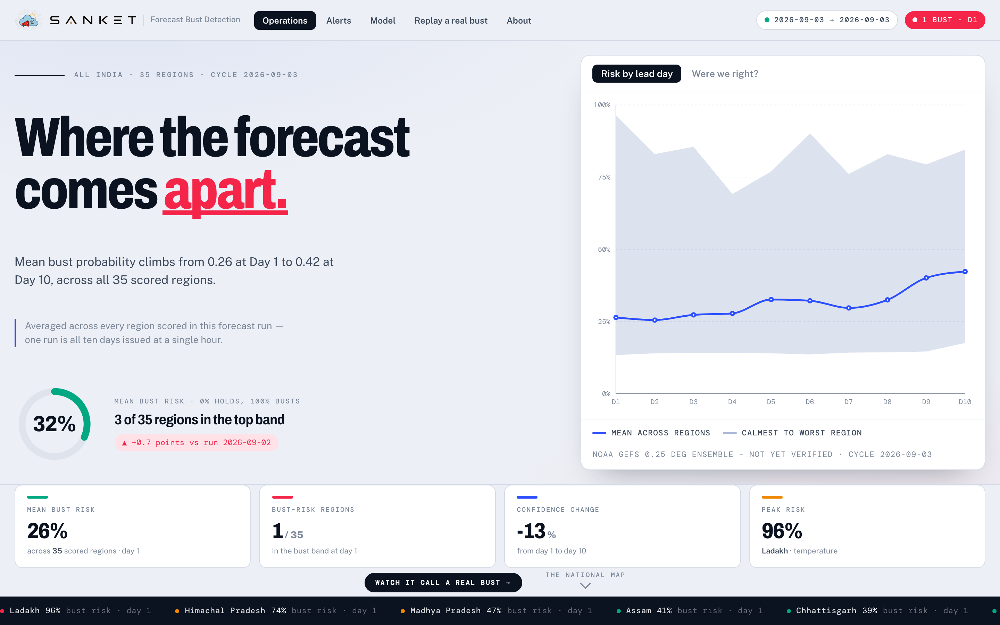
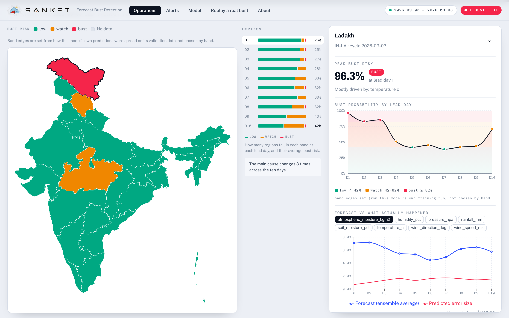
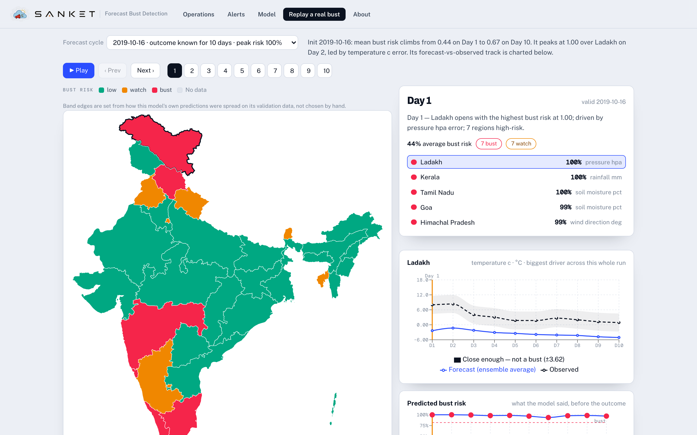
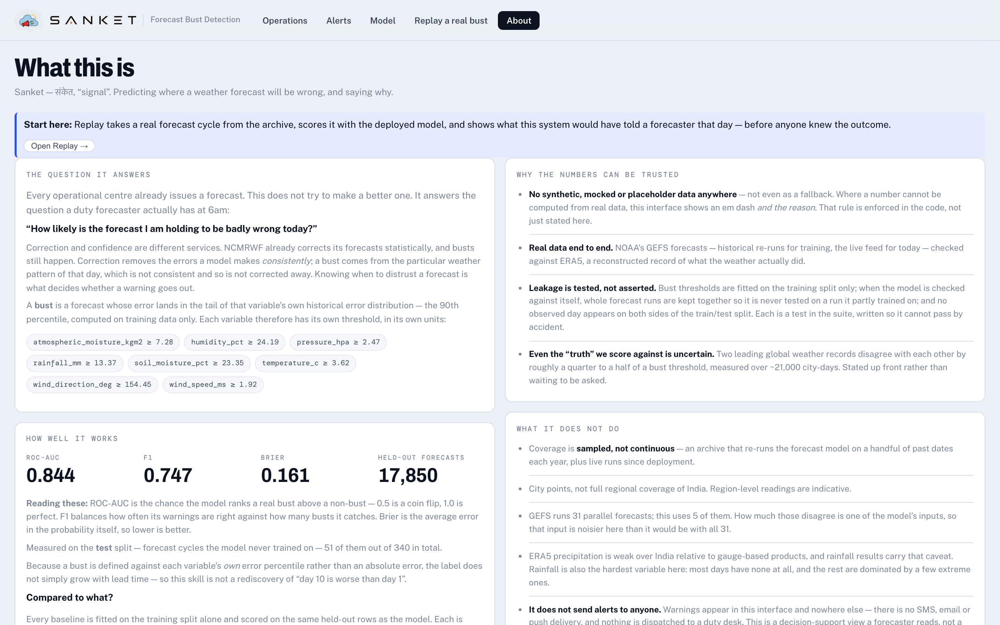

<div align="center">


# Sanket · संकेत

**Predicting where tomorrow's weather forecast will be wrong — and saying why.**

Smart India Hackathon 2026 · Problem Statement 26079 · NCMRWF, Ministry of Earth Sciences

[](https://sanket-a0dd.onrender.com)


</div>



---

## The question it answers

Every operational centre already issues a forecast. Sanket does not try to make a better
one. It answers the question a duty forecaster actually has at 6am:

> **"How likely is the forecast I am holding to be badly wrong today?"**

A **bust** is a forecast whose error lands in the tail of that variable's own historical
error distribution — the 90th percentile, computed on training data only. Sanket predicts
the probability of that, per region, per variable, out to Day 10, and attributes every
prediction to the inputs that drove it.

Correction and confidence are different services. NCMRWF already corrects its forecasts
statistically, and busts still happen: correction removes the errors a model makes
*consistently*, while a bust comes from the particular weather pattern of that day.
Knowing when to distrust a forecast is what decides whether a warning goes out.

## What it looks like

**Operations** — the national map, the horizon rail, and the region behind them. Every
figure is scored from the live model; nothing here is a placeholder.



**Replay a real bust** — the most convincing view. It takes a real historical forecast
cycle, scores it with the deployed model, and steps through its lead days, showing what
the system would have told a forecaster that day, *before anyone knew the outcome*.



**About** — the evidence, including the baseline ladder every claim is measured against.



## How it was built

<details>
<summary><b>Build log</b> — what each phase added, in order</summary>

- **Phase 1** — stack, folder scaffolding, canonical schema.
- **Phase 2** — ingestion + schema-mapping. Format-agnostic parsers (CSV/TSV/XLSX/JSON,
  NASA POWER header blocks + wide-month melt), a confidence-scored `SchemaMapper`
  (synonym + range heuristics, ambiguity/collision handling, `SourceProfile` reuse),
  point-in-polygon region resolution, and a canonicalisation pipeline writing a
  batch-partitioned parquet store with full SQLite lineage.
- **Phase 3** — ML. One XGBoost error regressor per canonical variable (target
  `|forecast − observed|`), a bust classifier at forecast-event grain trained on the
  regressors' out-of-fold predictions (leakage-safe), data-driven per-variable
  thresholds + percentile risk bands, and SHAP `top_factors`. `python -m
  app.ml.train_pipeline` does a full time-split retrain (~40 s) and writes a versioned
  `data/models/{run_id}/`; `current.json` flips only on full success.
- **Phase 4a** — FastAPI layer. `POST /api/upload` (+ `confirm-mapping`),
  `GET /api/regions`, `/api/regions/{id}`, `/api/alerts`, `/api/model/status`, and a
  `/ws` WebSocket broadcasting typed retrain events. Uploads ingest synchronously and
  kick off a full retrain as a BackgroundTask. See
  [`backend/app/api/README.md`](backend/app/api/README.md) for the contract.
- **Phase 4b** — React dashboard: clickable India choropleth with a lead-day selector,
  region detail panel (bust-probability curve, per-variable forecast-vs-observed
  trajectories, SHAP factors), alerts panel, and an upload + column-confirmation flow —
  all live over the WebSocket. See [`frontend/README.md`](frontend/README.md).
- **Phase 5** — the design pass. A single committed visual world: synoptic chart paper,
  Archivo/Public Sans/DM Mono, and a three-stop risk ramp (calm → watch → bust) used as a
  scale and never as decoration. A KPI strip derives mean P(bust), high-risk count,
  confidence decay across the horizon and the peak region from the scored cycle already in
  hand — a figure that cannot be computed renders as an em dash with the reason, never as a
  placeholder.
- **Phase 6** — live ingestion. A background scheduler pulls each published NOAA GEFS
  operational cycle (0.25°, Day 1–10, the same 5 members the models were trained on) and
  refreshes observations in two tiers: near-real-time *provisional* values that fill the
  charts within hours but are never trained on, and ERA5 *final* values that supersede
  them and trigger a retrain. `GET /api/ingest/status` reports real feed freshness, and
  the dashboard shows which cycle is actually loaded rather than implying "now". Off by
  default (`LIVE_INGEST_ENABLED`). See [`backend/app/live/README.md`](backend/app/live/README.md).
- **Guided replay** — a "Replay a real bust" tab picks a historical forecast cycle where
  a bust actually developed and steps through its lead days: the map recolours day by day
  while a narration — assembled from that cycle's own scored numbers, nothing scripted —
  explains which region climbed, by how much, and which variable drove it, alongside the
  forecast-vs-observed trajectory for the variable that diverged most. `GET /api/replay`.

</details>

Real sample data (`backend/data/samples/`, built by `backend/scripts/`) is NOAA GEFSv12
reforecast (forecast) + ERA5 (observations), now joined by live operational cycles — no
synthetic data anywhere. The test suite runs against those real files.

**Current metrics are served, not written down here.** The deployed model reports them at
[`/api/model/status`](https://sanket-a0dd.onrender.com/api/model/status) and the site's
**About** tab renders them, alongside the baseline ladder — climatology, lead-day and
ensemble-spread — scored on the same held-out rows. A figure copied into this file is
right until the next retrain and quietly wrong afterwards, which is the failure this
project exists to avoid; this README had exactly that problem, claiming ROC-AUC 0.76 from
a 17-cycle run long after the deployed model was trained on ten years.

What is stable enough to state: the classifier is scored only on forecast cycles it never
trained on, spanning two decades of the GEFSv12 reforecast archive, and it is compared
against those baselines on identical rows rather than reported alone.

> Regressor errors dropped ~17% on 2026-08-29 when a one-day forecast/observation
> misalignment was found and fixed: lead day *k* was built from forecast hours
> ((k−1)·24, k·24] but labelled `valid_date = init + k`, so every forecast was verified
> against the following day's observation. The convention is now
> `valid_date = init + (lead − 1)`; see
> [`backend/scripts/fix_forecast_valid_date_offset.py`](backend/scripts/fix_forecast_valid_date_offset.py).

## Quick start

Run both halves together — two terminals.

**macOS / Linux**

```bash
# terminal 1 — backend
cd backend && source .venv/bin/activate
uvicorn app.main:app --reload --port 8000     # API + docs at http://localhost:8000/docs

# terminal 2 — frontend
cd frontend && npm run dev                    # dashboard at http://localhost:5173
```

**Windows (PowerShell)**

```powershell
# terminal 1 — backend
cd backend
.\.venv\Scripts\Activate.ps1
uvicorn app.main:app --reload --port 8000     # API + docs at http://localhost:8000/docs

# terminal 2 — frontend
cd frontend
npm run dev                                   # dashboard at http://localhost:5173
```

If PowerShell blocks the activate script with an execution-policy error, run once:
`Set-ExecutionPolicy -Scope CurrentUser -ExecutionPolicy RemoteSigned`. Or use
**Command Prompt** instead, where activation is `.venv\Scripts\activate.bat`.

## Limitations

Stated plainly, because a reader should hit these before drawing conclusions.

- **Coverage is sampled, not continuous.** The reforecast archive is a handful of
  initialisations per year, not a daily record, plus the live cycles since deployment. A
  date range on its own would overstate it, so the site reports the cycle count beside it.
- **City points, not regional coverage.** Region-level readings are indicative. IMD's 36
  meteorological subdivisions are the right unit and are not what this uses.
- **5 of 31 GEFS ensemble members**, so spread-derived features are a noisy estimate of
  true ensemble spread. Widening it requires a retrain, not a config change.
- **ERA5 precipitation is weak over India** relative to gauge-based gridded products, and
  rainfall carries that caveat. Rainfall is also the hardest variable here: zero-inflated
  and heavily skewed.
- **The ground truth has its own error.** Measured against an independent reanalysis over
  ~21,000 paired city-days, two leading products disagree by roughly a quarter to a half
  of a bust threshold. That is the irreducible uncertainty in the label itself.
- **"Bust" is defined on surface-variable error**, not the synoptic criterion of Rodwell
  et al. (2013) — Z500 anomaly correlation below 0.4 at day 6. This is a deliberate
  choice, not an oversight: surface error is what reaches agriculture and disaster
  response, whereas Z500 is what reaches meteorologists.
- **The serving instance has 512 MB and cannot train.** It carries only the cycles needed
  to score and replay; training runs on CI against the full archive. The site reports both
  separately rather than conflating them.

## What would make this conclusive

The evidence base scales with data volume, and the gaps are known rather than vague: the
a retrained 31-member-compatible operational model instead of the current five-member serving contract; IMD's 36 subdivisions as the region
unit instead of city points; IMDAA and IMD gauge-based gridded rainfall as observations
instead of ERA5 alone; and the synoptic Z500 bust definition reported alongside the
surface-error one.

## System architecture

Raw forecasts and observations enter at the top left and run left to right into the
canonical store. There the path splits: one branch trains, the other serves, and they
never swap roles.

```
   SOURCES                    INGEST                      STORE
┌──────────────────┐    ┌────────────────────┐    ┌─────────────────────┐
│ NOAA GEFS        │    │ format-agnostic    │    │ canonical store     │
│  · NOMADS        │    │ parsers            │    │                     │
│    (India subset,│    │ SchemaMapper       │    │ hive-partitioned    │
│     last ~3 days)├───►│ geo resolver       ├───►│ Parquet             │
│  · AWS S3        │    │ (point-in-polygon) │    │ +                   │
│    (byte-ranged) │    │ completeness guard │    │ SQLite lineage      │
│                  │    │  → refuse, never   │    │                     │
│ ERA5             │    │    patch           │    │                     │
│  provisional     │    │                    │    │                     │
│  → final         │    │                    │    │                     │
└──────────────────┘    └────────────────────┘    └──────────┬──────────┘
                                                             │
                              ┌──────────────────────────────┴────┐
                              ▼                                   ▼
                  TRAIN — GitHub Actions              SERVE — Render free
                  ┌───────────────────────┐           ┌──────────────────────┐
                  │ 16 GB · never serves  │           │ 512 MB · never trains│
                  │                       │           │                      │
                  │ error regressors      │  model    │ FastAPI              │
                  │ bust classifier       │  release  │ scored-cycle cache   │
                  │ thresholds · SHAP     ├──────────►│ built SPA, one origin│
                  │ baseline ladder       │  artifact │ /api/*   /ws         │
                  └───────────────────────┘           └──────────┬───────────┘
                                                                 │
                                                                 ▼
                                                        React dashboard
                                                        map · detail · alerts
                                                        model · replay · about
```

**The split down the middle is the load-bearing decision.** Training peaks around 2.3 GB;
the serving box has 512 MB and is *killed* rather than throttled when it exceeds that. So
training runs on a CI runner that never answers a request, and the serving process never
trains. The model therefore carries the full archive while the box carries only what it
must serve — and a checksum step fails the run if training ever touches the serving store.

The CI/CD half of this — what triggers a retrain, what gets packaged, how the deploy
fires — is drawn separately under [Deploying](#deploying-github-actions--render-free).

## Monorepo architecture

Two deployables in one repo, plus the workflows that join them. There is no shared
package and no build orchestrator: the frontend compiles to static files that the backend
image copies in, which is why one process can serve both from a single origin.

```
sih-main/
├── backend/                  FastAPI service — API, ML, ingestion, storage
│   ├── app/
│   │   ├── api/              routers + Pydantic response schemas (the contract)
│   │   ├── db/               SQLAlchemy models, session, CRUD — lineage and metadata
│   │   ├── features/         feature engineering, pivot to forecast-event grain
│   │   ├── ingestion/        parsers, SchemaMapper, canonical schema, pipeline
│   │   ├── live/             NOAA GEFS feed, observations, scheduler, orchestrator
│   │   ├── ml/               regressors, classifier, thresholds, SHAP, registry, training
│   │   ├── realtime/         WebSocket broadcaster + typed retrain events
│   │   ├── services/         read-side logic behind each router
│   │   ├── storage/          hive-partitioned Parquet store
│   │   ├── utils/            geo resolution, India state codes
│   │   ├── config.py         env-driven settings (pydantic-settings)
│   │   └── main.py           app assembly, lifespan, static SPA mount
│   ├── data/                 samples, canonical store, trained runs, geo (gitignored)
│   ├── scripts/              data fetch, backfill, packaging, deploy refresh
│   └── tests/                pytest suite — runs against the real sample files
│
├── frontend/                 React + Vite + TypeScript dashboard
│   └── src/
│       ├── api/              typed fetch clients, mirroring backend/app/api/schemas.py
│       ├── components/       about · alerts · common · dashboard · detail
│       │                     map · model · replay · upload
│       ├── hooks/            TanStack Query hooks, live socket, media queries
│       ├── pages/            DashboardPage — the tab shell
│       ├── store/            zustand store for live events
│       ├── styles.css        the entire design system, hand-written
│       └── theme.ts          chart palette, mirroring the CSS tokens
│
├── docs/                     plan, audit, known issues, one-pager, analysis outputs
├── .github/workflows/        refresh · backfill · memory measurement · warm-on-push
├── Dockerfile                one image: builds the SPA, pulls the model, serves both
└── render.yaml               service definition, so the host is not hand-wired
```

Two conventions worth knowing before editing:

- **`frontend/src/api/types.ts` mirrors `backend/app/api/schemas.py` by hand.** There is no
  codegen step. Change a response shape and both files move together.
- **`theme.ts` mirrors the CSS custom properties in `styles.css`.** Recharts measures and
  interpolates real colour strings, so it cannot read `var(--blue)` — the duplication is
  deliberate and commented at both ends.

## Technology stack

| Layer | Choice | Why this one |
|---|---|---|
| API | **FastAPI** + **uvicorn** | Typed request/response models double as the OpenAPI contract |
| Validation | **Pydantic v2**, **pydantic-settings** | Response shapes are schemas, so an empty state cannot silently become a placeholder |
| ML | **XGBoost**, **scikit-learn**, **SHAP** | Gradient boosting on tabular features; SHAP is precomputed at train time, never on the request path |
| Data | **pandas**, **NumPy**, **PyArrow** | Arrow column projection is what keeps scoring inside the memory budget |
| Storage | **Parquet** (hive-partitioned) + **SQLite** via **SQLAlchemy 2** | Columnar for analytical reads; SQLite holds lineage and run history, not measurements |
| Geo | **Shapely** (STRtree), **d3-geo**, **topojson-client** | Point-in-polygon region resolution server-side; TopoJSON keeps the map payload small |
| Schema mapping | **RapidFuzz** | Confidence-scored column matching, so arbitrary CSV/XLSX uploads map to the canonical schema |
| Realtime | **websockets** | Typed retrain events; the client falls back to polling where the host cannot proxy them |
| UI | **React 18**, **TypeScript 5.5**, **Vite 5** | — |
| UI state | **TanStack Query 5**, **Zustand 4** | Query owns server state and cache invalidation; Zustand holds only live-socket events |
| Charts | **Recharts 2** | — |
| Styling | **Hand-written CSS**, one `styles.css` | No framework. The design system is ~40 KB of tokens and components, versioned as source |
| Tests | **pytest**, **httpx** | 230+ tests against real sample files — no fixtures that fabricate measurements |
| Live feed *(optional)* | **eccodes** / **ecmwflibs**, **cfgrib**, **xarray** | GRIB2 decoding, kept out of `requirements.txt` so the 512 MB image never installs it |
| Runtime | **Python 3.11 / 3.12** (3.9 works, **not 3.13**), **Node 18+** | One pinned dependency has no 3.13 wheel |
| Infra | **Docker**, **Render** free tier, **GitHub Actions**, **GitHub Releases** | Releases act as the model artifact store, so no object storage to pay for |

Every core dependency installs as a **prebuilt wheel** on Windows, macOS and Linux — a
plain `pip install -r requirements.txt` never invokes a compiler. Total hosting cost: **$0**.

## Backend setup

**Get the code with `git clone` — not GitHub's "Download ZIP"**, which extracts as a
doubled `sih-main-main/sih-main-main/` folder.

```bash
git clone https://github.com/hrithik-roshan19/Sanket-X.git
cd sih-main
```

Use **Python 3.11 or 3.12** (3.9 also works; **not 3.13 yet** — one pinned dependency has
no 3.13 wheel). Check with `py -0p` on Windows or `python3 --version` elsewhere; if you
only have 3.13, install 3.12 (`winget install Python.Python.3.12` /
[python.org](https://www.python.org/downloads/)) and build the venv with `py -3.12`.
Node 18+ for the frontend.

`pip install -r requirements.txt` installs **prebuilt wheels only** — no compiler, no
system libraries. GRIB2 decoding (`eccodes`) is *not* in the core set; it lives in
`requirements-live.txt` and is only needed to pull fresh NOAA cycles (see
[Enable live ingestion](#enable-live-ingestion-off-by-default)).

**macOS / Linux**

```bash
cd backend
python3 -m venv .venv && source .venv/bin/activate
pip install -r requirements.txt
cp .env.example .env
```

**Windows (PowerShell)**

```powershell
cd backend
py -3.12 -m venv .venv
.\.venv\Scripts\Activate.ps1
pip install -r requirements.txt
Copy-Item .env.example .env
```

**Windows (Command Prompt)**

```bat
cd backend
py -3.12 -m venv .venv
.venv\Scripts\activate.bat
pip install -r requirements.txt
copy .env.example .env
```

The venv only needs creating once; afterwards just re-run the activate line for your
shell in each new terminal.

## Frontend setup

**macOS / Linux**

```bash
cd frontend
npm install
cp .env.example .env
npm run dev
```

**Windows (PowerShell)**

```powershell
cd frontend
npm install
Copy-Item .env.example .env
npm run dev
```

(Command Prompt is identical except `copy .env.example .env`.)

## Common tasks (all platforms)

With the backend venv activated:

| Task | Command |
|---|---|
| Run the test suite | `pip install -r requirements-dev.txt` once, then `python -m pytest -q` |
| Full model retrain | `python -m app.ml.train_pipeline` |
| Rebuild the sample data | `python scripts/fetch_gefs_reforecast_sample.py` then `python scripts/fetch_era5_observations.py` (needs `requirements-live.txt`) |
| Ingest a file from the CLI | `python -m app.ingestion.pipeline --file <path> --confirm-all` |

### Enable live ingestion (off by default)

Live ingestion pulls fresh NOAA GEFS cycles and Open-Meteo observations. It needs the
GRIB2 decoder, which is a separate install:

```bash
pip install -r requirements.txt -r requirements-live.txt
python -m eccodes selfcheck        # should print "Your system is ready"
```

On **Windows** some `eccodes` wheels ship a broken definitions bundle (`Unable to find
boot.def`, `flex scanner error`). `requirements-live.txt` lists `ecmwflibs` first, which
supplies a working binary + definitions and usually fixes it. If `selfcheck` still fails,
use conda-forge (`conda install -c conda-forge eccodes python-eccodes`) or run the
backend under WSL2. The rest of the app — dashboard, scoring, guided replay, CSV/parquet
upload — does not need any of this.

Then turn it on:

```bash
# macOS / Linux
echo "LIVE_INGEST_ENABLED=true" >> backend/.env
```
```powershell
# Windows PowerShell
Add-Content backend\.env "LIVE_INGEST_ENABLED=true"
```

then restart `uvicorn`. A one-off pull without editing `.env`:
`curl -X POST "http://localhost:8000/api/ingest/run-cycle?wait=true"` (PowerShell:
`Invoke-RestMethod -Method Post "http://localhost:8000/api/ingest/run-cycle?wait=true"`).

## Deploying (GitHub Actions + Render, free)

One free Render web service serves the API **and** the built dashboard from a single
origin — no CORS, no second service, no proxy. The image never trains: a full retrain
peaks around 2 GB and the free tier gives 512 MB, so training happens on a GitHub Actions
runner and only the result is shipped.

```
GitHub Actions (16 GB, every 6 h)          Render Free (512 MB, serve only)
  pull the newest GEFS cycle                 docker build:
  refresh final observations                   node   → builds the dashboard
  retrain                                      curl   → pulls the release asset
  tar model + canonical + db  (~24 MB)         python → serves API + SPA
  publish to release tag `data-latest`  ────►  runs `uvicorn app.main:app`
  POST the Render deploy hook           ────►  redeploys with the fresh model
```

### One-time setup

1. **Seed the first artifact.** The image pulls `data-latest`; publish one from a machine
   that already has a trained model:

   ```bash
   cd backend
   python -m scripts.package_for_deploy /tmp/sanket-data.tar.gz
   gh release create data-latest /tmp/sanket-data.tar.gz \
     --title "Latest model and data" \
     --notes "Rolling artifact published by the refresh workflow."
   ```

   No `gh`? Build the tarball with the same command, then create the release through the
   web UI: **Releases → Draft a new release**, tag `data-latest`, and drag the file in.
   The packager ships only the *current* model run — taring `data/models` wholesale would
   grow the artifact by ~8 MB on every refresh.

   Skip this and the first build still succeeds — the site just reports
   `model_trained: false` and renders its empty state until the workflow runs.

2. **Create the Render service.** New → Blueprint → point at this repo. It reads
   [`render.yaml`](render.yaml); no console wiring to redo if the service is recreated.

3. **Wire the deploy hook.** Render → the service → Settings → Deploy Hook → copy the
   URL, then add it as the repo secret `RENDER_DEPLOY_HOOK`
   (Settings → Secrets and variables → Actions). Without it the workflow still publishes
   the artifact — only the automatic redeploy stops.

4. **Keep it warm.** Render Free spins down after 15 minutes idle (~30–50 s cold start).
   Point an external pinger (UptimeRobot, every 5 min) at `/api/health`. A browser tab
   will *not* work: polling pauses when the tab is backgrounded.

### What the free tier costs you

| Limit | Effect | Handling |
|---|---|---|
| 512 MB RAM | cannot retrain | Actions trains; upload panel hidden via `VITE_ENABLE_UPLOAD=false` |
| no WebSocket | no live push | client falls back to 60 s polling and reports the socket closed |
| spins down at 15 min | 30–50 s cold start | external pinger on `/api/health` |
| 750 instance-hours/mo | ≈ one always-on service | fine for a single service |

### Running the refresh by hand

Actions → **Refresh model and data** → *Run workflow*. `force_train` retrains even with no
newly-verified rows; `skip_forecast` retrains on what is already stored. Locally:

```bash
cd backend
python -m scripts.refresh_for_deploy --help
```

### Testing the deployed shape locally

The image builds the dashboard into `backend/app/static`, which `app/main.py` mounts only
if it exists — so this reproduces production without Docker, and removing the directory
restores normal split-process development:

```bash
cd frontend && VITE_ENABLE_UPLOAD=false npm run build
cp -r dist ../backend/app/static
cd ../backend && ./.venv/bin/python -m uvicorn app.main:app --port 8000
# http://localhost:8000 now serves the whole product from one origin
rm -rf app/static      # back to normal dev
```
